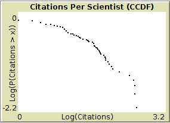

# DistExtension

The `dist` extension for NetLogo makes it easy to plot frequency distributions and complementary cumulative distribution functions in NetLogo.

The extension is still very raw and hasn't been fully test. **Please don't use in production code**.

Requires [NetLogo 6.0-BETA1](http://ccl.northwestern.edu/netlogo/6.0-BETA1/) or later.

### <tt>dist:frequencies <i>values log-x? log-y?</i></tt>

Reports a list of pairs, where the first element of the pair is a value and the second element is the frequency of that value in the `values` list.

The `log-x?` and `log-y?` arguments are booleans allowing one or both elements of the pair to be reported as base 10 logarithms.

```nlogo
observer> show dist:frequencies [1 1 1 2 2 3] false false
observer: [[0 0] [1 3] [2 2] [3 1]]
observer> show dist:frequencies [1 1 1 2 2 3] true true
observer: [[0 0.47712125471966244] [0.3010299956639812 0.3010299956639812] [0.47712125471966244 0]]
```

Values must be integers. Those that aren't are truncated (not rounded).

### <tt>dist:ccdf <i>values log-x log-y</i></tt>

Reports a list of pairs, corresponding to points in an [complementary cumulative distribution function](https://en.wikipedia.org/wiki/Cumulative_distribution_function#Complementary_cumulative_distribution_function_.28tail_distribution.29).

The `log-x?` and `log-y?` arguments are booleans allowing one or both elements of the pair to be reported as base 10 logarithms.

### <tt>dist:plot-points <i>points</i></tt>

The `dist:plot-points` command could be used with any list of points expressed as pairs, but it is especially convenient for using with `dist:frequencies` and `dist:ccdf`.

For example:

```
dist:plot-points dist:ccdf [ number-of-citations ] of scientists
```

Could result in:

 "CCDF plot")
